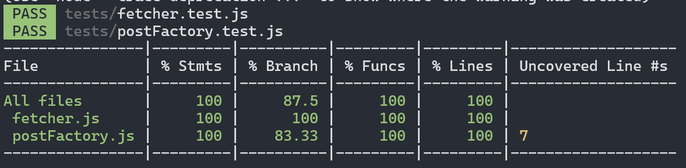
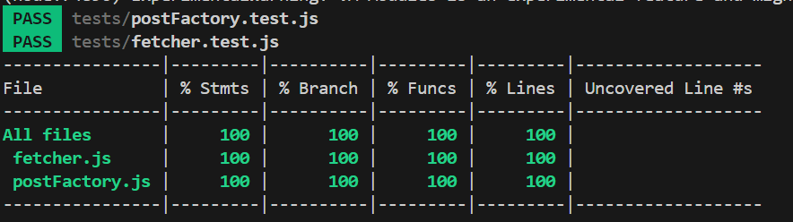

## Unit test

Unit test are the most simple test that we can create, to ensure, a piece of code, does what we expect it to. Not for our present selves, but for the future programmers of the project.

Rules when testing:

- Do not do network, read files, or any other operation that has external dependancies, this can lead to enormous times waiting for disk, network, and inconsistencies.
- When unit testing, always go first for the smaller functions in length and dependencies, this are easier to test, and unit test is the fastest test to execute

First example, division can have multiple edge cases, like dividing by 0, Infinity or using undefined/null values. in the example below, only big int division by 0 throws.

```javascript
function div(a, b) {
  return a / b;
}
describe("Test divide fn:", () => {
  test("it correctly divides", () => {
    expect(div(4, 2)).toBe(2);
  });
  test("it correctly divides big ints", () => {
    expect(div(4n, 2n)).toBe(2n);
  });
  test("it throws on divides big ints by 0n", () => {
    expect(() => div(4n, 0n)).toThrow();
  });
  test("it correctly returns Infinity on 0 division", () => {
    expect(div(4, 0)).toBe(Infinity);
  });
  test("it correctly returns NaN on Infinity/Infinity", () => {
    expect(div(Infinity, Infinity)).toBe(NaN);
  });
});
```

Such simple code, have a lot of edge cases and testing possibilities. Normally you will have to test all edge cases. Is better to test early, but if you did not see the edge case, in the first Iteration, add it as soon as you know about it.

### The Expect function

In the example before, we use some specific Jest functions (that are normally called the same in other testing libraries and even languages). the interesting one right now is **Expect**, it receives a value and returns an object with a ton of functions to verify what the value is or what happened for example

```javascript
expect(5 + 1).toBe(6); // pass
expect(true && false).toBe(false); //pass
```

In this example we have the function `toBe` as part of the returned object from expect you can check all properties/functions on: https://jestjs.io/docs/expect you can read it.
but is better to have it handy and learn by doing, there will be examples in the tests under `tests` folder in the root of this project

### Mocks Or Spies

Mock or Spies, let you spy on how a function is being used, and mock the output, For example, you can spy on a global function that is reading from files, or doing network request, as we don't want such behaviour, we mock it and return and show a values to test.

In the case of Jest, we can mock globals but first we need to add them to Jest globals in the `jest.config.js`:

```javascript
  globals: {
    fetch: global.fetch,
  },
```

Then we can mock the fetch in global like

```javascript
const fetchSpy = jest.spyOn(globalThis, "fetch").mockReturnValue(
  Promise.resolve({
    status: 200,
    json: async () => returnObject,
  })
);
```

### Coverage

Coverage is expected to be as high as possible, but not always 100%, not because is would not be valueble, but because a 100% coverage can be deceptive, let's see a coverage example



As you can see we have some parts to go trough, first 2 lines are the files that we are testing, and the status, in this case both happen to pass, and we get our dopamine shot.

The next table, has 6 columns, File, Percentage of Statements, Percentage of Branches, Functions, Lines being tested, and Uncovered Lines, and here we see a problem, i forgot to cover line #7.

```javascript
tags: Array.isArray(obj.tags) ? obj.tags : [],
```

in this case i forgot to cover sending undefined, null, numbers, strings to my function in the tags attribute. we can fix that easily with:

```javascript
let expected = { ... }
const postUndefined = postFactory.newPost(
    { ...expected, tags: undefined }
);
expect(Array.isArray(post.tags)).toBe(true);
```

This piece of code will try to generate a post with undefined tags, and in parsing it, we will instead generate an empty array. Cause our external API returns an undefined/null for tags when post is not tag with them, and our app should not break, when this happens, we parse and move on. afterwards, we test again and...



It seems we have all of our code tested, but thats not completely true, all lines are tested but in postFactory we have this if statement

```javascript
if (obj.id && obj.title && obj.data) {
```

with this code, if we only test for one of `obj.id`, `obj.title` or `obj.data` we will have 100% coverage rate, but when one of these cases happens in the worst case scenario it may break our app, or simply not update the post, or shown title, etc.
we need to be careful not to trust coverage faithfully, but to use it to guide us, on how much works still needs to be done.

### Tests placement

There is no big directive in javascript where you test should go, but normally is done in two way, they have their own test folder (like in this project), or they have a test file on the side of the file they are testing. Note: There are other ways in other languages like, adding the test in the same file the way Rust [does it](https://doc.rust-lang.org/rust-by-example/testing/unit_testing.html), I think this would be a preferable way, as you can access private functions for testing without exporting just for testing, or trying some weird magic, but it is not available for us in JS land.

#### Option 1:

<pre>
- src
+-- item.ts
/-- util
    +-- helper.ts

- test
+-- item.test.ts
/-- util
    -- helper.test.ts
</pre>

#### Option 2:

<pre>
/ src
+-- item.ts
+-- item.test.ts
/-- util
    +-- helper.ts
    `-- helper.test.ts
</pre>

Some projects prefer Option 2, some others prefer Option 1, and the reason for this project being Option 1 is simple, i'm not doing any processing to the files, and i need to test my front end files being served, i don't want tests to be served by the server so i dont add the to the `public` folder, i could still add them there, but it would make the next code, more complex, and error prone.

```javascript
app.use("/public", express.static("public"));
```

This is a good technical reason why, we would want to have the test in a separate folder, it can be fix but still you would need to be careful, The following reasons, are aesthetic reasons; one camp just like to have all their tests in a tidy place where it doesnt bother source code, and the other camp likes to have the unit test file along side their source, and both are fine, both ways are ok, and if you bundle your files, there's no technical reason to go with one or another.

if the project is starting, you can have a chat with your peers and decide how you are going to handle it. if the project already exists, my suggestion would be to continue with the same way as to no create unnecesary friction, that time can be use better creating new tests and checking edge cases.

> [!NOTE]
>
> This sections apply not only to Unit Test, but to other kinds of tests too.
